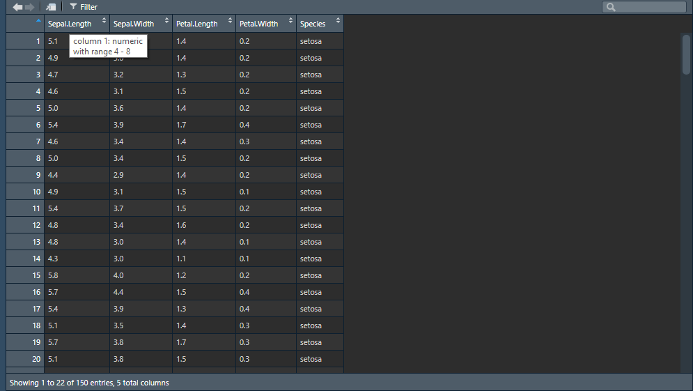

# Objekte und Datenstrukturen

Wir können R bzw. RStudio nun als Taschenrechner verwenden und uns arithmetische Operationen direkt in der Konsole ausgeben lassen:

```{r, results='hold'}
1 + 2 # Addition
1 - 2 # Subtraktion
2 * 2 # Multiplikation
4 / 2 # Division
2 ^ 5 # Exponentiation
```

Wirklich sinnvoll ist dies aber nicht: wir wollen Ergebnisse ja auch speichern und weiterverwenden können. Hierfür benötigen wir Variablen, also Namen, denen wir (veränderliche) Werte zuordnen können.

In R lassen sich Variablen erstellen, indem wir einer Zeichenkette (zu den Benennungsregeln kommen wir gleich) einen Wert mittels `<-` zuordnen (hierfür entweder die Zeichen `<` und `-` eingeben oder die Tastenkombination `Alt/Option + -` drücken).^[Es ist prinzipiell auch möglich, die Zuordnung mittels einem `=` vorzunehmen. Da das `=` aber auch in anderen Kontexten benötigt wird, erzeugt dies Verwirrung, sodass wir Objekte immer mit `<-` zuordnen sollten.] Dies erstellt ein _Objekt_^[Die Begriffe Variable und Objekt können für unsere Zwecke weitestgehend synonym verwendet werden. Wir werden aber gleich noch sehen, das so ziemlich alles in R ein Objekt sein kann.] mit eben diesem Namen und der entsprechenden Zuordnung:

```{r}
x <- 2
```

Führen wir diesen Befehl aus, erstellen wir das Objekt `x` und ordnen den Wert `2` zu. Wir sollten diese neue Zuordnung zudem im rechten oberen _Environment_-Bereich sehen können.

Wir können nun mit diesem Objekt weiterrechnen:

```{r, results='hold'}
x * 2
x + 5
x / 2
```

Um den aktuellen Wert eines Objektes anzuzeigen, können wir auch einfach das Objekt ausführen:

```{r}
x
```

Generell wird bei der Zuordnung immer zunächst der Teil rechts vom `<-` ausgeführt und dann zugeordnet. Wir können also auch komplexere Befehle ausführen und diese Zuordnen:

```{r}
y <- (2 + 4) * (3 - 1) / 2
y
```

Objekte sind veränderlich und können jederzeit neu zugeordnet werden - und dabei auch selbst bei der Zuordnung verwendet werden:

```{r, results='hold'}
x <- 2
x
x <- 3
x
x <- x - 1
x
```

Schauen wir uns das einmal in einem etwas komplexeren Beispiel an - welchen Wert hat `b` am Ende dieser Befehlskette?

```{r}
a <- 10
b <- a / 2
a <- b * 2 + a
b <- a - b
```

Die Antwort lautet `15`. Gehen wir das der Reihe nach durch:

1. Zunächst ordnen wir `a` den Wert `10` zu.
2. Dann orden wir `b` den Wert `a / 2` zu. Da `a` in diesem Schritt `10` zugeordnet ist, wird `10 / 2` gerechnet. `b` entspricht nun also dem Wert `5`.
3. Wir ordnen nun `a` den Wert `b * 2 + a` zu. Der gesamte Teil rechts vom `<-` wird zuerst ausgeführt und dann zugeordnet, hier also `5 * 2 + 10`. `a` entspricht nun dem Wert `20`, b weiterhin dem Wert `5`.
4. Zuletzt ordnen wir `b` das Ergebnis von `a - b` zu, was vor dieser Zuordnung `20 - 5` bedeutet. `b` entspricht schlussendlich also `15`.

Nochmals die wichtigsten Punkte zusammengefasst:

- Mit `<-` erstellen wir Objekte und ordnen diesen Werte zu.
- Alle Objekte sind veränderlich und können überschrieben werden.
- Bei einer Zuordnung wird der gesamte Teil rechts vom Zuordnungspfeil `<-` zuerst ausgeführt und dann die Zuordnung vorgenommen.

## Objektnamen

Für die obigen Beispiele haben wir nur einzelne Buchstaben für Objekte verwendet. In der Praxis können und sollten wir längere Objektnamen verwenden. Dabei gelten folgende Regeln:

- Objektnamen können Groß- und Kleinbuchstaben, Ziffern sowie Punkte `.` und Unterstriche `_` beinhalten. Andere Sonderzeichen, Umlaute und Leerzeichen sind nicht gestattet.
- Objektnamen können mit einem Buchstaben oder einem `.` beginnen, nicht jedoch mit Ziffern oder `_`.
- Objektnamen sind _case-sensitive_, d. h. unterscheiden zwischen Groß- und Kleinschreibung. `myVar` und `myvar` sind also unterschiedliche Objekte.

Es ist sinnvoll, Objekten "sprechende" Namen zu geben, sodass andere (und auch Sie zu einem späteren Zeitpunkt) nachvollziehen können, was sich dahinter verbirgt, auch ohne den gesamten Code zu lesen.

```{r}
# Gute Objektnamen
mittelwert <- 2.5
mein_alter <- 32
groesse_in_cm <- 175

# Schlechte Objektnamen
x1 <- 2.5
var2 <- 32
asdasdasd <- 175
```

Es gibt außerdem unterschiedliche Konventionen, um mehrere Wörter in Objektnamen aneinanderzuhängen. `mein_alter` ist ein Beispiel für den sogenannten *snake_case*: Alle Wörter kleingeschrieben und durch einen Unterstrich `_` miteinander verbunden. Einen Überblick über verbreitete Konventionen der Objektbenennung gibt folgende Illustration:


Was auch immer Sie wählen - wichtig ist vor allem, dass Sie einheitlich vorgehen.^[Aufmerksamen Leser*innen dürfte zudem aufgefallen sein, dass _kebab-case_ in R nicht möglich ist.] 

## Objekttypen {#objecttypes}

Bisher haben wir lediglich Zahlen Objekten zugewiesen. Natürlich können Daten aber auch in anderen Formen vorliegen; wir sprechen daher von verschiedenen _Objekttypen_.^[Tatsächlich ist die Sache etwas komplexer: es gibt in R einige wenige Kernobjekttypen, die wiederum mit bestimmten Attributen versehen werden können, um daraus zusätzliche Objekttypen abzuleiten. So kann etwa eine Zahlenfolge mit einem zusätzlichen Attribut als Datumsangabe interpretiert werden. Für unsere Zwecke spielt diese Unterscheidung jedoch keine Rolle.]

### Numerische Objekte

Zahlenwerte werden in R als `numeric` bezeichnet. Wir können hier zudem zwischen den Typen `integer` (ganze Zahlen) und `double` (Kommazahlen^[Der Typenbezeichnung leitet sich von [Gleitkommazahlen mit doppelter Genauigkeit](https://de.wikipedia.org/wiki/Doppelte_Genauigkeit) ab.]) unterscheiden. 

Grundsätzlich ordnet R Zahlen als `double` zu, auch wenn nur ganze Zahlen zugeordnet werden.

```{r}
x <- 4
typeof(x) # Mit dieser Funktion können wir den Objekttyp anfordern
```

Um explizit den Typ `integer` anzufordern, muss Zahlenwerten ein `L` nachgestellt werden:^[Warum `L`? Hier gibt es unterschiedliche Erklärungsansätze, die beispielsweise [hier](https://stackoverflow.com/questions/22191324/clarification-of-l-in-r/22192378#22192378) nachgelesen werden können]

```{r}
x <- 4L
typeof(x)
```

In der Praxis macht es aber kaum einen Unterschied, ob eine ganze Zahl als `integer` oder `double` abgespeichert wird -- `integer` verbraucht weniger Speicherplatz, aber das wird erst bei _sehr_ großen Datensätzen relevant. Wir können die Unterscheidung also guten Gewissens ignorieren und von numerischen Objekten sprechen.

### Textobjekte

Wir können Objekten auch Text zuordnen - diese Objekte haben dann den Typ `character` (Textvariablen werden zudem häufig als "string" bezeichnet). Um ein `character`-Objekt zu erstellen, müssen wir die Zeichenkette in einfache `''` oder doppelte `""` Anführungszeichen setzen:

```{r}
text1 <- "Guten Morgen!"
text2 <- 'Einfache Anführungszeichen sind sinnvoll, wenn im "Text" ebenfalls Anführungszeichen vorkommen'
```

Natürlich können auch Zahlen als Text gespeichert werden - werden dann aber natürlich auch als Text behandelt, sodass man nicht mehr mit ihnen rechnen kann.

```{r}
zahl_als_text <- "123"
```

### Logicals (logische Objekte) {#logicals}

Der dritte Kernobjekttyp heißt `logical` und kann nur zwei Werte annehmen: `TRUE` (wahr) oder `FALSE` (falsch). Logicals entstehen durch logische Vergleiche zweier Objekte, wobei u.a. folgende Operatoren verwendet werden können:

Table: (\#tab:logischeoperatoren) Logische Operatoren in R

| Operator | Vergleich          | Beispiele                                                 |
|----------|--------------------|-----------------------------------------------------------|
|   `==`   |     ist gleich     | `1 == 1` (ergibt `TRUE`)<br>`"a" == "b"` (ergibt `FALSE`) |
|   `!=`   |  ist nicht gleich  | `1 != 1` (ergibt `FALSE`)<br>`"a" != "b"` (ergibt `TRUE`) |
|    `<`   |   ist kleiner als  |    `1 < 2` (ergibt `TRUE`)<br>`2 < 2` (ergibt `FALSE`)    |
|    `>`   |   ist größer als   |    `2 > 1` (ergibt `TRUE`)<br>`2 > 2` (ergibt `FALSE`)    |
|   `<=`   | ist kleiner gleich |    `1 <= 2` (ergibt `TRUE`)<br>`2 <= 2` (ergibt `TRUE`)   |
|   `>=`   |  ist größer gleich |    `2 >= 1` (ergibt `TRUE`)<br>`2 >= 2` (ergibt `TRUE`)   |

Die Zuordnung erfolgt wie bei anderen Objekten auch:

```{r}
x <- "a" == "b"
x
```

Logicals werden vor allem bei Wenn-Dann-Bedingungen benötigt, mit denen wir uns im übernächsten Kapitel auseinandersetzen werden.

### Weitere Objekttypen

Diese drei Objekttypen (`numeric`, `character`, `logical`) bilden die Basis fast aller Objekte in R. Durch zusätzliche Attribute können jedoch noch zusätzliche Objekttypen erzeugen, die den Umgang mit bestimmten Daten erleichtern. Für kategoriale Variablen kennt R beispielsweise den Typ `factor`, für Datumsangaben den Typ `date`. Diese werden bei der Zuordnung nicht automatisch erkannt und müssen stattdessen durch bestimmte Funktionen erzeugt werden. 

Erzeugen wir beispielsweise ein Objekt mit einer Zeichenfolge, die ein Datum repräsentiert (z. B. `date1 <- "2020-05-05"`, im Format _YYYY_MM_DD_, also Jahr-Monat-Tag), speichert R dies zunächst als `character` ab. Wir können aber R explizit sagen, dass er dies als Datum behandeln soll:

```{r}
date2 <- as.Date("2020-05-05")
```

Dies hat nun u.a. den Vorteil, dass wir im Gegensatz zu `character`-Objekten auch arithmetische Operationen durchführen können, also beispielsweise zwei Datums-Objekte voneinander subtrahieren, um die zeitliche Differenz zu berechnen. 

Wir werden uns im späteren Verlauf noch ausführlicher mit diesen spezielleren Objekttypen beschäftigen -- bis jetzt nehmen Sie vor allem mit, dass sowohl kategoriale Variablen als auch Datumsangaben kein Problem für R darstellen.

### Fehlende Werte {#missingvals}

Fehlende Werte werden in R als `NA` angegeben. Es ist sinnvoll, fehlende Werte immer explizit als `NA` zu kennzeichnen und nicht etwa durch einen negativen Wert bei numerischen Variablen (z. B. `-9`) oder durch einen leeren String bei Textvariablen (`""`), damit sichergestellt ist, dass Funktionen den fehlenden Wert auch entsprechend als einen solchen behandeln.

### Objekttypen ändern {#coercion}

Bisweilen wird es relevant sein, Objekttypen zu ändern - etwa weil Zahlen fälschlicherweise als Text eingelesen wurden. Hierfür bietet R Funktionen an, die allesamt nach dem Schema `as.[Objekttyp]()` aufgebaut sind: mit `as.numeric()` wandeln wir Objekte in numerische Objekte um (genauer gesagt in `double`), mit `as.character()` in Textobjekte und, wie im vorigen Abschnitt gesehen, mit `as.Date()` in ein Datumsobjekt. Der Fachbegriff hierfür lautet _Coercion_, wir _zwingen_ R also dazu, ein Objekt als einen bestimmten Typ zu behandeln, auch wenn R automatisch einen anderen Typus bestimmt hätte.

```{r, results='hold'}
x1 <- "25"
x1
typeof(x1)
x2 <- as.numeric("25")
x2 # Beachten Sie, dass in der Ausgabe nun die Anführungszeichen fehlen
typeof(x2)
```

Natürlich klappt das nur, solange die Umwandlung auch sinnvoll durchführbar ist -- in allen anderen Fällen wird eine Warnung ausgegeben und es werden fehlende Werte erzeugt.

```{r, results='hold'}
x <- as.numeric("Dieser Text kann nicht sinnvoll als Zahl interpretiert werden")
x
```

## Datenstrukturen

Bisher haben wir einem Objekt immer nur einen einzigen Wert zugeordnet. Der Fachbegriff hierfür lautet _Skalar_ und beschreibt somit die einfachst mögliche Datenstruktur, eben dass einem Objekt nur ein einziger Wert zugeordnet wurde. Objekte können in R jedoch auch mehrere Werte enthalten und somit komplexere Datenstrukturen erzeugen.

Im Folgen betrachten wir daher die vier wichtigsten komplexeren Datenstrukturen in R. Diese unterscheiden sich zum einen in ihrer Dimensionalität (also ob sie ein- oder zweidimensional sind) und zum anderen, ob sie homogene (also nur dieselben) oder heterogene (also unterschiedliche) Objekttypen beinhalten können:

Table: (\#tab:datenstrukturen) Datenstrukturen in R

| Datenstruktur | Dimensionalität | Objekttypen |
|---------------|-----------------|-------------|
| Vektor        | eindimensional  | homogen     |
| Liste         | eindimensional  | heterogen   |
| Matrix        | zweidimensional | homogen     |
| Dataframe     | zweidimensional | heterogen   |

### Vektoren {#vectors}

Vektoren sind Objekte, die mehrere Werte desselben Typs beinhalten. Wir erzeugen Vektoren über die Funktion `c()` (von _concatenate_, also verketten). Die einzelnen Elemente des Vektors werden durch Kommas `,` getrennt.

```{r, results='hold'}
gerade_zahlen <- c(2, 4, 6, 8)
gerade_zahlen
ungerade_zahlen <- c(1, 3, 5, 7, 9)
ungerade_zahlen
simpsons <- c("Homer Simpson", "Marge Simpson", "Bart Simpson", "Lisa Simpson", "Maggie Simpson")
simpsons
```

Wir können auch Vektoren über `c()` mit einander verketten:

```{r}
zahlen <- c(gerade_zahlen, ungerade_zahlen)
zahlen
```

Beachten Sie, dass die Verkettung immer in der angegebenen Reihenfolge erfolgt -- R sortiert die Elemente also nicht automatisch.

#### Vektorelemente auswählen

Um bestimmte Elemente eines Vektors auszuwählen, können wir die gewünschten Elemente in eckigen Klammern `[]` hinter einem Vektor definieren. Hier geben wir nur das zweite Element des oben erzeugten `zahlen`-Vektors aus:

```{r}
zahlen[2]
```

Um mehrere Elemente eines Vektors auszugeben, benötigen wir wiederum einen Vektor mit den gewünschten Positionen -- hier geben wir uns beispielsweise das erste, dritte und fünfte Element aus:

```{r}
zahlen[c(1, 3, 5)]
```

#### Vektorelemente benennen

Elemente in Vektoren können benannt werden, indem beim Erstellen die Namen der Elemente mit einem `=` angegeben werden:

```{r}
homer <- c(nachname = "Simpson", vorname = "Homer", wohnort = "Springfield")
homer
```

Benannte Elemente können dann auch über den Namen ausgewählt werden:

```{r}
homer["wohnort"]
```

Auch dies funktioniert mit mehreren Elementen gleichzeitig:

```{r}
homer[c("vorname", "nachname")]
```

Alternativ können Elementnamen im Nachhinein über die Funktion `names()` hinzugefügt werden:

```{r}
marge <- c("Simpson", "Marge", "Springfield")
names(marge) <- c("nachname", "vorname", "wohnort")
marge
```

#### Mit Vektoren rechnen {#vectorarithmetics}

Mit numerischen Vektoren können arithmetische Berechnungen durchgeführt werden:

```{r, results='hold'}
zahlen + 1
zahlen * 2
```

Berechnungen werden dabei der Reihe nach für jedes einzelne Vektorelement durchgeführt. Es ist auch möglich, Vektoren gleicher Länge zu addieren, subtrahieren etc. -- im Falle einer Addition wird dann das erste Element des ersten Vektors zum ersten Element des zweiten Vektors addiert, dann das zweite Element des ersten Vektors zum zweiten Element des zweiten Vektors usw.:

```{r}
x1 <- c(1, 3, 5)
x2 <- c(2, 3, 4)
x1 * x2
```

#### Nützliche Vektorfunktionen

Abschließend einige nützliche Funktionen für den Umgang mit Vektoren:

- `length()` gibt die Anzahl der Elemente eines Vektors aus.
- Die unter \@ref(coercion) eingeführten _Coercion_-Funktionen (`as.numeric()`, `as.character()` usw.) können auch auf Vektoren angewendet werden und wandeln so jedes Vektorelement um.
- Für numerische Vektoren stehen zahlreiche statistische Funktionen bereit, z. B. zur Berechnung der Summe (`sum()`), des arithmetischen Mittels (`mean()`) und der Standardabweichung (`sd()`)

```{r, results='hold'}
x <- c(10, 24, 32, 999)
length(x)
sum(x)
mean(x)
sd(x)
```

Oftmals benötigen wir aufsteigende Zahlenfolgen für Vektoren, beispielsweise für laufende Nummern. Dies lässt sich über die Funktion `:` abkürzen, die einen Vektor `Startwert:Endwert` erstellt:

```{r}
eins_bis_zehn <- 1:10
eins_bis_zehn
```


### Listen

Listen ähneln zunächst Vektoren und werden mit der Funktion `list()` erzeugt. Auch die Benennung von Listenelementen erfolgt analog zu Vektoren entweder beim Erstellen der Liste mit `=` oder im Nachhinein mit `names()`:

```{r}
munich_facts <- list(name = "München", bundesland = "Bayern", bezirk = "Oberbayern")
munich_facts
```

Wir sehen aber bereits am Konsolenoutput, dass die Darstellung von Vektoren abweicht: anstatt alle Elemente nebeneinander angezeigt zu bekommen, werden die einzelnen Elemente untereinander angezeigt.

Das rührt daher, dass Listen deutlich mächtiger und flexibler sind als Vektoren. Nicht nur können wir in den einzelnen Elementen Objekttypen mischen, wir sind auch nicht auf einzelne Werte (Skalare) als Elemente beschränkt. Tatsächlich kann so gut wie jedes Objekt ein Listenelement sein -- also auch Vektoren, ganze Datensätze und sogar Listen (die wiederum eigene Listen enthalten können -- wir können hier also Daten prinzipiell endlos verschachteln). Erweitern wir dazu die Liste von oben:

```{r}
munich_facts <- list(
  namen = c(hochdeutsch = "München", englisch = "Munich", bairisch = "Minga"),
  bundesland = "Bayern",
  gruendungsjahr = 1158,
  daten = list(
    einwohner = 1471508,
    geographie = c(flaeche_in_km2 = 310.7, hoehe_NHN_in_m = 519)
  )
)
munich_facts
```
Mit ihrer Flexibilität stellen Listen in R die Basis für nahezu alle komplexeren Datenstrukturen -- auch bei Datensätzen, Regressionsmodellen etc. handelt es sich um Listen, die mit bestimmten Attributen versehen wurden.

#### Listenelemente auswählen

Auch die Auswahl von Listenelementen funktioniert ähnlich wie bei Vektoren über die numerische Position oder den Elementnamen:

```{r}
munich_facts[1]
munich_facts["daten"]
```

Vielleicht ist Ihnen bereits das Dollarsymbol `$` vor den Elementnamen aufgefallen -- dieses verweist auf eine Funktion, mit der Listenelemente noch komfortabler ausgewählt werden können:

```{r}
munich_facts$bundesland
```

Nicht nur sparen Sie sich ein paar Zeichen bei der Eingabe, RStudio macht Ihnen auch automatisch Vorschläge, sobald Sie das Dollarzeichen eingetippt haben (im Beispiel also ab `munich_facts$`), welche Elemente sie auswählen können. Auch tiefer verschachtelte Elemente können so ausgewählt werden:

```{r}
munich_facts$daten$einwohner
```

#### Nützliche Listenfunktionen

Auch für Listen stehen einige nützliche Funktionen zur Verfügung, die die Arbeit mit ihnen erleichtern.

`length` gibt wie auch schon bei Vektoren die Anzahl der Elemente aus (wobei auch komplexere Elemente, also z. B. Vektoren, Listen etc., jeweils als ein Element gezählt werden):

```{r}
length(munich_facts)
```

Spezifisch für Listen relevant ist die Funktion `str()`, die zusätzliche Informationen über die Struktur der Liste ausgibt, was gerade bei verschachtelteren Listen den Überblick erleichtert:

```{r}
str(munich_facts)
```

Wir sehen, dass die Liste `munich_facts` aus 4 Elementen besteht `List of 4`. Das erste Element trägt den Namen `namen` ist ein benannter `character`-Vektor (abgekürzt durch `chr`) mit 3 Elementen (Angabe `[1:3]`) usw.

Durch die komplexe Struktur sind Listen jedoch nicht so einfach zu handhaben. Mittels der Funktion `unlist()` können Listen daher in Vektoren (inkl. Elementnamen, soweit vorhanden) umgewandelt werden:

```{r}
munich_facts_vector <- unlist(munich_facts)
munich_facts_vector
```

### Matrizen

Matrizen sind Vektoren, die in eine zweidimensionale Struktur, also Zeilen und Spalten, überführt werden und können mit der Funktion `matrix()` erstellt werden. Hierzu ist zusätzlich noch die Anzahl an Zeilen, in die der Vektor aufgeteilt werden soll, nötig:

```{r}
x <- 1:10 # Zahlen von 1 bis 10 als Vektor
m <- matrix(x, nrow = 2) # Vektor in Matrix mit zwei Zeilen aufteilen
m
```

Alternativ können wir mehrere Vektoren mit den Funktionen `cbind()` spaltenweise (von *c*olumn) und `rbind()` zeilenweise (von *r*ow) zu einer Matrix "zusammenkleben".

```{r}
x1 <- 1:4
x2 <- 5:8
x3 <- 0:3
m <- cbind(x1, x2, x3)
m
```

#### Matrizen benennen

Auch Matrizen können benannt werden. Da wir nun aber eine zweidimensionale Struktur haben, können wir entsprechend auch Zeilen und Spalten einzeln benennen. Hierfür gibt es die Funktionen `rownames()` und `colnames()`, die analog zu `names()` verwendet werden:

```{r}
colnames(m) <- c("spalte_1", "spalte_2", "spalte_3")
rownames(m) <- c("zeile_a", "zeile_b", "zeile_c", "zeile_d")
m
```

#### Nützliche Matrixfunktionen

`length()` funktioniert auch für Matrizen und gibt die Anzahl aller Elemente an. Interessieren wir uns dagegen für die Anzahl an Zeilen und Spalten, gibt die Funktion `dim()` Aufschluss, die einen Vektor mit der Anzahl der Zeilen und der Anzahl der Spalten ausgibt:

```{r, results='hold'}
length(m)
dim(m)
```

Die Funktion `t()` transponiert die Matrix, dreht die Matrix also um 90 Grad und vertauscht somit Zeilen und Spalten:

```{r}
t(m)
```

### Dataframes

Mit Matrizen kommen wir der Datensatzstruktur, wie wir sie von SPSS oder Excel kennen, schon recht nahe. Allerdings repräsentieren Matrizen Vektoren und sind daher auf einen Objekttyp beschränkt. Diese Einschränkung hebt die Datenstruktur _Dataframe_ auf, mit der gleich lange Vektoren unterschiedlichen Typs kombiniert werden können. Wir erstellen Dataframes mit der gleichnamigen Funktion `data.frame()`:

```{r}
beatles_data <- data.frame(
  name = c("John", "Paul", "George", "Ringo"),
  surname = c("Lennon", "McCartney", "Harrison", "Starr"),
  born = c(1940, 1942, 1943, 1940)
)
beatles_data
```

Wenn wir mit tabellarischen Daten arbeiten, geschieht das also in der Regel mit Dataframes. Natürlich wäre es nicht zielführend, wenn wir diese immer von Hand erstellen müssten. Es gibt daher Funktionen, mit denen wir externe Dateien (z. B. CSV-, Excel- und sogar SPSS-Dateien) als Dataframes in R laden können. Wie wir externe Dateien laden, schauen wir uns zu einem späteren Zeitpunkt genauer an.

#### Beispiel-Dataframes

R enthält einige eingebaute Beispiel-Dataframes, mit denen Funktionen demonstriert und geübt werden können. Keiner davon hat auch nur einen geringen KW-Bezug, aber damit wir nun auch ohne große Erstellungs-Arbeit mit Dataframes arbeiten können, nutzen wir diese dennoch. Wir werden aber bald auch mit für Sie relevanteren Daten arbeiten, versprochen.

Diese Beispiel-Datensätze sind direkt als Objekte hinterlegt und können durch Eingabe des Objektnamens genutzt werden. Wir arbeiten nun mit dem Datensatz `iris`, der Blütenblatt- und Kelchblatt-Daten zu je 50 Exemplaren dreier Spezies von Schwertlilien (englisch _iris_) umfasst. Wie gesagt, keinerlei KW-Bezug, aber immerhin ein Grund, um den Text kurz durch einige Blumenfotos aufzulockern.


#### Arbeiten mit Dataframes

Dataframes basieren auf Listen und Vektoren (genau genommen ist ein Dataframe eine Liste von gleich langen Vektoren, die zweidimensional dargestellt wird). Entsprechend können wir eine Vielzahl der Funktionen, die wir bei Listen und Vektoren kennengelernt haben, auch auf Dataframes anwenden.

In der Regel haben wir Datensätze, die mehr als nur ein paar Fälle umfassen. Sie in der Konsole ausgeben zu lassen, ist daher nur bedingt sinnvoll. Besser ist es, Informationen über die Struktur des Datensatzes über Funktionen abzufragen.

Die `length()`-Funktion gibt bei Dataframes die Anzahl der Spalten zurück (wir erinnern uns: Dataframes sind Listen, deren Elemente die Spaltenvektoren sind; entsprechend ermittelt `length()` daher die Anzahl der Vektoren). Die Anzahl der Zeilen -- mithin die Anzahl der Fälle -- gibt die Funktion `nrow()` aus. Beide Werte gemeinsam können wir erneut über `dim()` ausgeben.

```{r, results='hold'}
length(iris)
nrow(iris)
dim(iris)
```

Wir sehen, dass der `iris`-Datensatz 5 Spalten (= Variablen) und 150 Zeilen (= Fälle) umfasst. Für einen Überblick bietet sich wie auch schon bei Listen die `str()`-Funktion an.

```{r}
str(iris)
```

Der Datensatz umfasst also 4 numerische Variablen (jeweils Länge und Breite des Blüten- (*sepal*) und des Kelchblattes (*petal*)) sowie eine kategoriale Faktorvariable mit 3 Stufen, in der die Spezies des jeweiligen Exemplars festgehalten ist.

150 Fälle à 5 Variablen wären im Konsolenoutput sehr lang und unübersichtlich. Wollen wir dennoch in unsere Daten spähen, können wir uns mittels `head()` und `tail()` die ersten bzw. letzten Zeilen des Datensatzes ausgeben. Standardmäßig werden bei beiden Funktionen 6 Fälle angezeigt.

```{r}
head(iris)
```

R bietet auch einen Viewer, mit dem der gesamte Datensatz ähnlich wie ein Tabellenblatt in Excel oder die Datenansicht in SPSS angezeigt wird. Hierzu führen wir die Funktion `View()` aus (großes `V` beachten), woraufhin in RStudio ein eigener Reiter mit der Datenansicht geöffnet wird.

```{r, eval=FALSE}
View(iris)
```



In der Datenansicht können wir den Datensatz nach Variablen sortieren oder bestimmte Wertebereiche je Variable filtern; in der Fußzeile werden Strukturinformationen (Zeilen- und Spaltenanzahl) angezeigt. Fährt man mit dem Mauszeiger über die Kopfzeilen der Variablen, werden zudem weitere Informationen (Objekttyp und Wertebereich) eingeblendet.

Um einzelne Variablen (also Spalten bzw. die dahinterliegenden Vektoren) auszuwählen, können wir wie auch bei Listen das `$`-Zeichen nutzen:

```{r}
iris$Sepal.Length
```

Das Resultat hat den Objekttyp Vektor. Wir können daher die uns bekannten Vektorfunktionen auf das Resultat anwenden. Um beispielsweise den Mittelwert der Kelchblattbreite zu erhalten, geben wir folgendes ein:

```{r}
mean(iris$Petal.Width)
```

Auch die eckigen Klammern `[]` können genutzt werden, um flexibler nur bestimmte Teile des Datensatzes anzuzeigen. Dabei ist die zweidimensionale Struktur zu beachten -- wir können zwei Werte bzw. Vektoren, getrennt durch ein `,`, übergeben, die dann die Zeilen respektive die Spalten anwählt. Um etwa die ersten zehn Zeilen der Variablen `Sepal.Length` und `Petal.Length` auszuwählen, ist folgender Code nötig:

```{r}
iris[1:10, c("Sepal.Length", "Petal.Length")]
```

Sollen lediglich Zeilen oder nur Spalten gefiltert werden, lassen wir den jeweiligen Wert vor (Zeilen) oder nach dem `,` (Spalten) leer. Folgender Code gibt die Zeilen 5-10 und alle Spalten aus:

```{r}
iris[5:10,]
```

Auch die Benennung von Dataframes läuft analog zu den bisherigen Objekttypen ab. Um etwa die Variablen einzudeutschen, können wir wieder `names()` nutzen^[Da Dataframes eine zweidimensionale Struktur darstellen, können wir auch die Funktionen `colnames()` und `rownames()`, die wir von den Matrizen kennen, verwenden, um die Spalten respektive Zeilen umzubenennen. `colnames()` und `names()` sind bei Dataframes äquivalent; Zeilennamen sind eher unüblich. In der Praxis wird daher meistens lediglich `names()` verwendet.]:

```{r}
names(iris) <- c("bluetenblatt_laenge", "bluetenblatt_breite", 
                 "kelchblatt_laenge", "kelchblatt_breite",
                 "spezies")
head(iris)
```

Falls Ihnen das nun umständlich erscheint -- keine Sorge, wir werden, sobald wir uns ans richtige Datenmanagement begeben, Funktionen kennenlernen, die die obigen Schritte deutlich erleichtern. Für das Grundverständnis ist es aber wichtig, auch diese Art der Arbeit mit Dataframes kennenzulernen.

```{r, include=FALSE}
# reset iris
iris <- datasets::iris
```


## Übungsaufgaben

Erstellen Sie für die folgenden Übungsaufgaben eine eigene Skriptdatei und speichern diese als `ue2_nachname.R` ab. Antworten auf Fragen können Sie direkt als Kommentare in das Skript einfügen.

---

```{exercise, label="ue2a1"}
Objekttypen und Datenstrukturen I:
```
Erstellen Sie ein Objekt `myself`, das folgende Elemente enthält:

- `name`: Ihren Namen
- `born`: Ihr Geburtsjahr
- `from_bavaria`: Sind Sie in Bayern geboren?

Welche Datenstruktur ist hierfür am sinnvollsten? Welche Objekttypen haben die einzelnen Elemente?

---

```{exercise, label="ue2a2"}
Vektorfunktionen, Objekttypen und -umwandlung:
```
Führen Sie folgenden Code aus:

```{r, eval=FALSE}
values <- c(1.2, 1.3, 0.8, 0.7, 0.7, 1.5, 1.1, 1.0, 1.1, 1.2, 1.1)
average <- mean(values)
above_average <- values > average
sum(above_average) / length(values)
```

Beschreiben Sie in eigenen Worten, was hier in jeder Zeile passiert. Was bedeutet das Resultat der letzten Codezeile? Warum wird hier überhaupt ein Resultat ausgeben? Schauen Sie sich hierzu an, was passiert, wenn Sie `above_average` in einen numerischen Vektor umwandeln.

---

```{exercise, label="ue2a3"}
Arbeiten mit Dataframes:
```
Im Beispiel-Datensatz `mtcars` sind einige Daten zu verschiedenen KfZ-Modellen hinterlegt. Beantworten Sie die folgenden Fragen zum Datensatz mittels Funktionen:

- Wie viele Variablen und Fälle befinden sich in dem Datensatz?
- Welche der drei Objekttypen (`numeric`, `character`, `logical`) kommen in dem Datensatz vor?
- Wie viele Zylinder haben die enthaltenen Fahrzeuge im Durchschnitt? (Zylinder: `cyl`)
- Erstellen Sie einen neuen Datensatz `cars_short`, der lediglich die Variablen `mpg` und `hp` enthält.