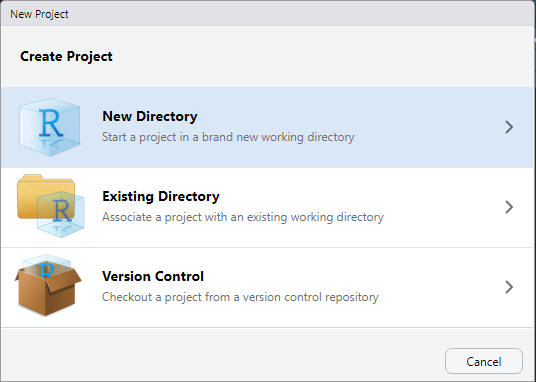
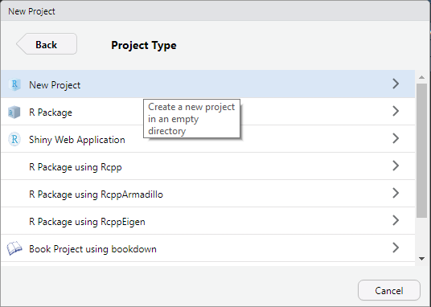

# Workflow

Zum Abschluss der Einführung in die Grundlagen von R schauen wir uns noch einige Möglichkeiten an, effizient(er) mit R und RStudio arbeiten zu können. 

## Arbeitsverzeichnisse

Abgesehen von den Skripten für die Übungsaufgaben haben wir bisher noch nicht mit Dateien gearbeitet. In Zukunft sieht dies natürlich anders aus: wir laden Datensätze auf unserer Festplatte, erstellen Skripte und speichern unsere Ergebnisse, z. B. in Form von Tabellen oder Abbildungen. 

Sobald wir daher mit Dateien arbeiten, wird das Konzept des Arbeitsverzeichnisses relevant, da R basierend auf diesem nach Dateien sucht. Unser aktuelles Arbeitsverzeichnis können wir mit dem Befehl `getwd()` (für *w*orking *d*irectory) anzeigen.

Nehmen wir einmal an, unser Arbeitsverzeichnis lautet `C:/Projekte/R`. R wird nun Pfadangaben zu Dateien _relativ_ zu diesem Verzeichnis betrachten. Eine Datensatz-Datei `beispiel.csv`, die in diesem Verzeichnis liegt (deren gesamter Dateipfad also `C:/Projekte/R/beispiel.csv` ist), könnten wir mit der Funktion `read.csv()`, die zum Einlesen von CSV-Dateien verwendet wird, daher über `read.csv("beispiel.csv")` laden. Läge die Datei in einem Unterordner `data` (wäre der vollständige Dateipfad also `C:/Projekte/R/data/beispiel.csv`), müssten wir entsprechend `read.csv("data/beispiel.csv")` angeben. Gleiches gilt auch für Dateien, die wir mit R erstellen -- geben wir keinen weiteren Pfad an, so landen diese im Hauptordner des aktuellen Arbeitsverzeichnisses.

Umgekehrt bedeutet dies auch, dass es umständlich wird, Dateien zu laden, die außerhalb unseres Arbeitsverzeichnisses (also im Beispiel in einem anderen Ordner auf `C:`) liegen. Zwar kann immer auch der gesamte Dateipfad angegeben werden (z. B. `read.csv("C:/Projekte/R/data/beispiel.csv")`), das hat aber die Nachteile, dass Sie immer sehr viel tippen müssen und vor allem, dass Ihre Skripte nur noch auf Ihrem eigenen Rechner laufen, da Sie auf anderen Rechnern mit hoher Wahrscheinlichkeit auch eine andere Ordnerstruktur haben.

Es ist daher wichtig, sich a) eine sinnvolle Ordnerstruktur zu überlegen und b) sicherzustellen, dass R auch das korrekte Arbeitsverzeichnis nutzt. Das Arbeitsverzeichnis kann mit der Funktion `setwd()` festgelegt bzw. geändert werden -- allerdings bietet R-Studio noch eine Funktionalität, die das nochmals deutlich erleichert:

## Projekte und Ordnerstrukturen {#rprojects}

RStudio bietet mittels Projekten eine einfache Möglichkeit, alle relevanten Projektdateien zusammenzuhalten und das Arbeitsverzeichnis automatisch zu setzen. Projektdateien (Dateieindung `.rproj`) sind prinzipiell nichts weiter als "Markierungen" für RStudio, dass es sich bei einen Ordner auf der Festplatte (und den darin enthaltenen Dateien) um ein Analyseprojekt mit R handelt. 

Erstellen wir also unser erstes R-Projekt für diesen Kurs: Klicken Sie in RStudio auf _File - New Project_ und wählen Sie im sich nun öffnenden Fenster _New Directory_ und anschließend _New Project_ aus. Im folgenden Fenster können Sie Ihrem Projekt einen sinnvollen Namen (z. B. "R-Kurs") geben und das Verzeichnis auswählen, in dem Ihr Projekt erstellt werden soll (RStudio erzeugt darin einen Unterordner mit dem Namen des Projekts):





Schließen Sie nun RStudio und navigieren zu dem Projektordner auf Ihrer Festplatte. Durch einen Doppelklick auf die `.rproj`-Datei öffnet sich RStudio mit diesem Projekt; das Arbeitsverzeichnis wird automatisch auf den Hauptordner des Projektes gesetzt, der _Files_-Browser im rechten unteren Bildschirmbereich zeigt ebenfalls dieses an.

Am rechten oberen Bildschirmrand wird Ihnen außerdem das aktuelle Projekt angezeigt -- bearbeiten Sie mehrere Projekte gleichzeitig, können Sie hier auch direkt von einem Projekt in ein anderes wechseln (oder sogar mehrere gleichzeitig in unterschiedlichen RStudio-Sessions öffnen). 


Schließlich ist nun auch ein guter Zeitpunkt, sich eine Ordnerstruktur zu überlegen. Ich persönlich lege (nummerierte) Skriptdateien meist direkt im Hauptordner des Projektes ab, speichere alle relevanten Datensätze in einem Unterordner `data`, und alle Ergbnisse in entsprechend benannten Unterordnern (z. B. `tables` und `figures`). Finden Sie hier vor allem eine Struktur, in der Sie sich -- und im besten Falle auch andere, wenn Sie Daten aus einem Projekt anderen zur Verfügung stellen -- intuitiv zurechtfinden.


## R Markdown

_R Markdown_ ist ein Dateiformat (Endung: `.Rmd`) von RStudio, das es erlaubt, Code, Ergebnisse und freien Text in nur einem Dokument zu kombinieren. Es ist dementsprechend gut geeignet, um Analyseschritte und die dahinterstehenden Entscheidungen und Gedanken festzuhalten. Zudem können solche Dokumente schnell in andere Dokumenttypen -- z. B. HTML-Websiten, PDF-Dateien oder Word-Dokumente -- umgewandelt werden.


Wir erstellen R-Markdown-Dokumente über _File - New File - R Markdown_. Im folgenden Fenster können wir einen Dokumenttitel, Ausgabeformat usw. einstellen -- all dies lässt sich aber auch später noch bearbeiten, sodass Sie fürs erste die Standardeinstellungen übernehmen können. Die erzeugte Datei ist bereits mit etwas Beispieltext gefüllt und besteht aus drei Komponenten:

### YAML-Header

Ganz oben steht ein (optionaler) Block in der Auszeichnungssprache _YAML_ (für *Y*et *A*nother *M*arkdown *L*anguage), abgetrennt durch `---`, der die Outputoptionen festlegt.

```{}
---
title: "Auswertung"
author: "Julian Unkel"
date: "4/29/2020"
output: html_document
---
```

Je nach Ausgabeformat können hier noch weitere Optionen angegeben werden, beispielsweise ob automatisch ein Inhaltsverzeichnis erzeugt werden soll. Auch hier reichen die Standardeinstellungen fürs erste jedoch vollkommen aus.

### Freitext in Markdown {#markdown}

Freier Text kann jeder Stelle in das Dokument eingefügt werden. Dabei nutzt das Format die Formatierungssyntax _Markdown_ (daher auch der Dateiformatname), mit der sich Text schnell mittels bestimmter Symbole formatieren lässt. Die Grundidee dahinter ist, dass man sich beim Schreiben auf das Schreiben konzentriert und alle wesentlichen Formatierungen im Nachhinein automatisiert auf Basis von Vorlagen erfolgen. Einige Formatierungsoptionen sind:

Table: (\#tab:rmarkdown) Einige Formatierungsoptionen in R Markdown

| Syntax                                              | Erzeugt                                                                                    |
|-----------------------------------------------------|--------------------------------------------------------------------------------------------|
| Klartext                                            | Klartext                                                                                   |
| `_kursiv_`<br>`*kursiv*`                            | _kursiv_<br>*kursiv*                                                                       |
| `__fett__`<br>`**fett**`                            | __fett__<br>**fett**                                                                       |
| `# Überschrift`<br>`## Überschrift`<br>`### Überschrift`  | Überschrift erster Ebene<br>Überschrift zweiter Ebene<br>Überschrift dritter Ebene         |
| `- Listenpunkt 1`<br>`- Listenpunkt 2`                | - Listenpunkt 1<br>- Listenpunkt 2                                                         |
| `1. nummerierte Liste`<br>`2. Listenpunkt 2`          | 1. nummerierte Liste<br>2. Listenpunkt 2                                                   |

Ein gelungener Spickzettel für R Markdown findet sich zudem [hier](https://rstudio.com/wp-content/uploads/2015/06/rmarkdown-german.pdf).

### Code Chunks

R-Code kann in speziellen Blöcken hinzugefügt werden, die durch ```` ```{r} ```` (und einem optionalen Namen hinter `r`) eingeleitet werden und abschließend ```` ``` ```` begrenzt werden. Alles innerhalb dieser Blöcke ("Chunks") wird als R-Code interpretiert. Einfacher können R-Code-Chunks mit der Tastenkombination `Strg/Cmd + Alt + I` eingefügt werden. 

Einzelne Codezeilen können wie gehabt mit `Strg/Cmd + Enter/Return` ausgeführt werden; mittels `Strg/Cmd + Shift + Enter/Return` oder durch Klick auf den grünen "Play"-Knopf am rechten oberen Ende des Chunks wird der gesamte Code des Chunks auf einmal ausgeführt. Die Besonderheit dabei ist, dass das Ergebnis direkt unter dem Chunk -- und nicht in der Konsole -- angezeigt wird, sodass Sie Code damit auch sehr schön gliedern können. Die Codebeispiele in der erzeugten R-Markdown-Datei verdeutlichen dies -- einzelne Werte, Tabellen und auch Grafiken können so direkt in dem Dokument angezeigt werden.

### Ausgabedateien erzeugen

Mit einem Klick auf den "Knit"-Knopf (mit Stricksymbol) am oberen Rand wird die im Header definierte Ausgabedatei erzeugt -- standardmäßig also eine HTML-Datei, die im Arbeitsverzeichnis abgelegt wird und mit jedem Browser geöffnet werden kann. Auch dies können Sie einmal mit dem Beispielcode ausprobieren.

Diese Einführung kann nicht alle Ausgabeformate in Detail ansprechen -- hier gibt es aber inzwischen vielfältige Möglichkeiten, die quasi den gesamten wissenschaftlichen Prozess abdecken, aber natürlich auch etwas Einarbeitung erfordern: mittels spezieller Packages lassen sich so unter anderem Präsentationen, PDF-Berichte (inklusive Literaturverwaltung und automatischer Formatierung von Ergebnistabellen nach gängigen wissenschaftlichen Standards) oder ganze Webseiten erstellen (auch dieser Kurs bzw. diese Website ist komplett in R Markdown erstellt). 

Übungsaufgaben können Sie zukünftig sowohl als R-Skript (`.R`) als auch als R Markdown (`.Rmd`) abgeben. 


## R aktuell halten

Wie bei jeder anderen Software auch sollte die Arbeitsumgebung in R durch regelmäßige Updates aktuell gehalten werden, um neue Features, Fehlerkorrekturen, Performance-Verbesserungen und Beseitigungen von Sicherheitslücken zu erhalten. Da wir mit unterschiedlichen Komponenten -- R, RStudio und jeder Menge Packages -- arbeiten, müssen all diese Komponenten auch getrennt geupdated werden.

### Packages aktualisieren

Am häufigsten sollten Sie Ihre installierten Packages aktualisieren. Dies geht in RStudio sehr komfortabel über _Tools - Check for Package Updates_, wodurch alle Packages angezeigt werden, für die Updates bereitstehen. Nach einer Auswahl der gewünschten Packages können Updates gesammelt über den Button _Install Updates_ heruntergeladen und installiert werden.

Um nur ein einzelnes Packages zu aktualisieren, kann dieses auch einfach über die Funktion `install.packages("package_name")` mit der aktuellsten Version neu installiert werden.

### RStudio aktualisieren

Auch RStudio kann direkt aus dem Programm heraus aktualisiert werden. Hier empfiehlt es sich, regelmäßig unter _Help - Check for Updates_ zu überprüfen, ob eine Aktualisierung bereitsteht.

### R aktualisieren

Etwas unkomfortabler ist es, R selbst zu aktualisieren. Dass eine neue Version bereitsteht, erfährt man häufig dadurch, dass Packages beim Laden darauf aufmerksam machen, dass Sie mit einer aktuelleren Version von R als der aktuell installierten erstellt wurden. Das liest sich in der Konsole dann so:

```
Warning message:
package ‘package_name’ was built under R version x.x.x
```

Das Updaten funktioniert dabei ebenso wie eine Neuinstallation, wie sie in Kapitel \@ref(rinstallieren) beschrieben wurde -- RStudio sollte die neue R-Version dann automatisch erkennen (die aktuell installierte R-Version wird stets beim Starten von R/RStudio in der Konsole angezeigt). Dabei ist zu beachten, dass installierte Packages nicht von einer R-Version zur nächsten kopiert werden; es ist also entweder manuelles Kopieren oder eine Neuinstallation der Packages nötig.

Unter Windows kann zudem das Paket `installr` genutzt werden, dessen Funktion `updateR()` prüft, ob eine neue R-Version bereitsteht, diese herunterlädt und installiert sowie die Möglichkeit bietet, automatisch Packages der alten Installation für die neue Installation zu kopieren (was nicht immer auch funktioniert). Allerdings wird empfohlen, diese Funktion nicht in RStudio, sondern direkt in R zu nutzen.

Da vorige Woche eine neue Hauptversion von R erschienen ist (`R 4.0.0`) und wir aktuell noch kaum Packages installiert haben, die wir durch ein Update verlieren könnten, ist nun ein guter Zeitpunkt, um diese Version zu installieren. Falls Sie einen Mac nutzen, führen Sie also eine Neuinstallation von R wie unter Kapitel \@ref(rinstallieren) beschrieben durch.

Auch unter Windows können Sie diesen Weg wählen -- oder Sie probieren das `installr`-Package aus. Hierzu installieren Sie das Package zunächst über `install.packages("installr")`. Schließen Sie dann RStudio und öffnen R (Sie finden R in der Regel im Startmenü unter R; das gibt Ihnen auch die Gelegenheit, wertzuschätzen, wie viel komfortabler RStudio ist). In die Konsole können Sie nun `installr::updateR()` ein und folgen den Anweisungen des Installationsprogramms. 

In beiden Fällen sollte beim nächsten Start von RStudio in der ersten Konsolenzeile die neue R-Version angezeigt werden:

```
R version 4.0.0 (2020-04-24) -- "Arbor Day"
```