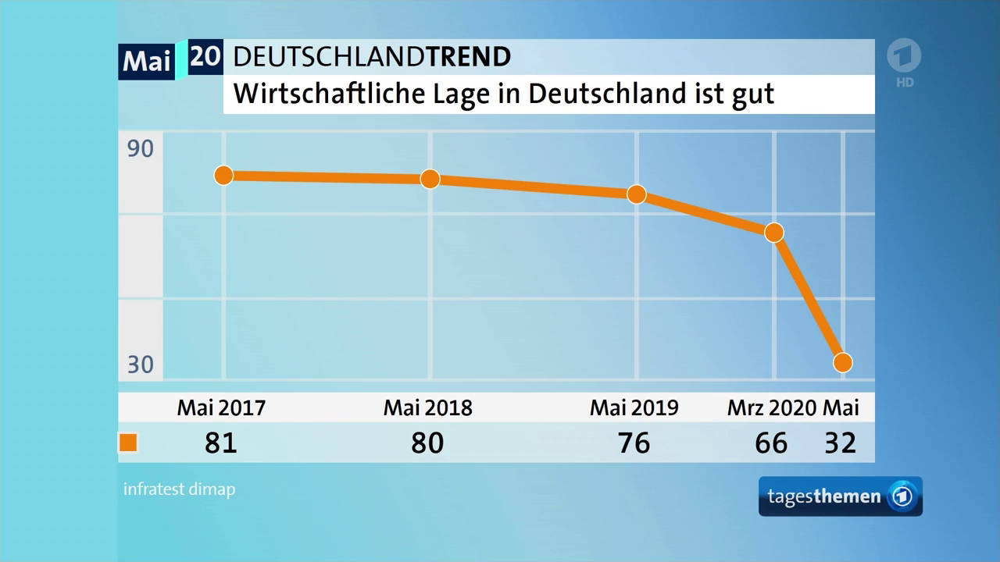

# Daten visualisieren

Ein wichtiger Schritt bei der Datenexploration -- und später auch bei der Veröffentlichung und Kommunikation -- ist die Visualisierung von Daten, da wir so Auffälligkeiten und Zusammenhänge finden und verdeutlichen können, die uns durch reine deskriptive Auswertungen verborgen bleiben. 

Die Basisversion von R bietet bereits einige Funktionen zur Datenvisualisierung, darunter die Funktion `plot()`, die je nach übergebenem Objekt (bzw. übergebenen Objekten) eine zugehörige Visualiserung erzeugt, beispielsweise Scatterplots für numerische Objekte oder diagnostische Plots für Regressionsmodelle. 

Im Tidyverse übernimmt das Package `ggplot2` sämtliche Schritte der Datenvisualisierung und stellt hierfür eine eigene Syntax -- ein "*grammar of graphics*" -- bereit, die sehr viele Möglichkeiten und Flexibilität bei der Datenvisualisierung eröffnet, aber auch entsprechend eine eigene Lernkurve aufweist. Daher ist es sinnvoll, sich zunächst mit einigen Grundlagen der Datenvisualisierung vertraut zu machen.

## Grundlagen der Datenvisualisierung

Auch wenn uns in den Medien häufig Datenvisualisierungen begegnen und wir im Studium auch schon selbst Datenvisualisierungen erstellt haben, lohnt es sich, die Entscheidungen, die hinter einer solchen Visualisierung stehen, zu verdeutlichen. Wir können solche Entscheidungen auf drei wesentliche Elemente einschränken:

- _Endodings_ (bzw. _Aesthetics_): Welche Daten bzw. welche Variablen sollen in welche visuellen Elemente (z. B. X-Achse, Y-Achse, Farben) übertragen werden?
- _Geometrics_: Wie sollen diese visuellen Elemente in dem (zumeist) zweidimensionalen Raum, den uns eine grafische Darstellung zur Verfügung stellt, dargestellt werden (z. B. als Punkte, Linien, Balken)?
- _Scales_: Auf welchen Skalen sollen die betreffenden Skalen abgebildet werden?

Nehmen wir als aktuelles Beispiel Ergebnisse aus dem _ARD Deutschlandtrend_:



Wir können diese Grafik intuitiv vermutlich schnell erfassen und "lesen", ohne uns groß über diese Entscheidungen gedanken zu machen. Versuchen wir dennoch, diese Visualisierung und die dahinterstehenden Daten zu entschlüsseln:

- Die Grafik basiert auf zwei Variablen: eine Zeitvariable (in Monaten) sowie eine numerische Variable, in der die prozentuale Zustimmung zur Aussage "Die wirtschaftliche Lage in Deutschland ist gut" festgehalten ist. Diese beiden Variablen sind in verschiedenen visuellen Elementen _kodiert_ (&rarr; *Encodings*): die Zeit ist auf der X-Achse abgetragen, die Zustimmung auf der Y-Achse.
- Die in diesen visuellen Elementen kodierten Werte werden nun durch geometrische Formen (&rarr; *Geometrics*) dargestellt: die einzelnen Wert-Kombinationen aus beiden Variablen (z. B. Mai 2017 / 81 Prozent) sind als Punkte im Koordinatensystem abgetragen und werden zusätzlich durch Linien verbunden.
- Die Darstellung wird maßgeblich durch Entscheidungen zur Skalierung (&rarr; *Scales*) beeinflusst: Die Zeitvariable (X-Achse) beginnt im Mai 2017 und endet im Mai 2020. Die Prozentvariable (Y-Achse) zeigt nicht den gesamten möglichen Wertebereich, sondern umfasst lediglich den Bereich von 30 bis 90 Prozent.

Alle anderen Grafikbestandteile -- Farben, Wertebeschriftungen etc. -- lassen in diesem Fall keine zusätzlichen Aussagen über die zugrundeliegenden Daten aus bzw. kommunizieren keine weiteren Daten, sondern dienen dem Erscheinungsbild.

Ziehen wir noch eine zweite Visualisierung aus derselben _tagesthemen_-Ausgabe heran, vermutlich eine der bekanntesten Visualisierungen politischer Kommunikationsdaten in Deutschland: die Sonntagsfrage ("Welche Partei würden Sie wählen, wenn am nächsten Sonntag Bundestagswahl wäre?").


- in dieser Grafik sind erneut zwei Variablen kodiert: die kategoriale Variable Partei und die numerische Variable Wahlabsicht.^[Man könnte argumentieren, dass als dritte Variable zusätzlich noch die Veränderung der Wahlabsicht im Vergleich zum Vormonat ersichtlich ist; diese ist aber lediglich als (zusätzliche) Wertbeschriftung abgetragen, nicht jedoch im eigentlichen Diagrammbereich visuell kodiert.] Partei ist dabei gleich _doppelt_ visuell kodiert: zum einen auf der X-Achse, zum anderen auch farblich -- eine solche doppelte Kodierung erfolgt aus Gründen der Ästhetik und Lesbarkeit, fügt der Visualisierung aber keine weiteren Informationen hinzu^[Wir können das leicht überprüfen, indem wir uns die Grafik jeweils ohne die andere Kodierung feststellen: auch wenn alle Balken gleichfarbig wären, könnten wir ohne Probleme dieselben Schlüsse aus der Grafik ziehen; würde die Kodierung "X-Achse" wegfallen, wären die Parteien also nicht nebeneinander auf der Achse abgetragen, sondern in einem Balken übereinandergestapelt, würden wir die einzelnen Balkenabschnitte durch die Farben auseinanderhalten können.]. Wichtig ist, dass wir eine Variable zwar mehrfach kodieren, niemals aber dieselbe visuelle Kodierung für mehrere Variablen verwenden können. Die aktuelle Wahlabsicht ist auf der Y-Achse abgetragen.
- als geometrische Form der Datenrepräsentation wurden Balken (bzw. Säulen) gewählt, deren Form und Aussehen entsprechend der visuellen Kodierungen durch Wahlabsicht (Höhe der Balken) und Partei (Farbe der Balken, Position auf der X-Achse) bestimmt wird.
- bei der Skalierung der X-Achse wurde eine Anordnung der kategorialen Ausprägungen -- d.h., der Parteien -- nach dem Ergebnis der Bundestagswahl 2017 (und nicht etwa alphabetisch, oder absteigend nach aktueller Wahlabsicht etc.) gewählt. Die Y-Achse reicht von 0 bis zum Maximalwert der Daten (in diesem Fall also 39 Prozent); und auch die Farbskalierung folgt einer bewussten Entscheidung -- nämlich, dass den kategorialen Ausprägungen der Partei-Variablen die zuegehörige Parteifarbe zugeordnet wurde.

Diese drei Schritte -- _Encoding_, _Geometrics_, _Scales_ -- stellen also die wesentliche Entscheidungen der Datenvisualisierung dar. Schauen wir uns nun an, wir diese Schritte in R umsetzen können.

## Datenvisualisierung mit `ggplot2`

Das Package `ggplot2` -- das zu den Kernpackages des Tidyverse gehört und entsprechend mit `library(tidyverse)` direkt mitgeladen wird -- orientiert sich an dieser schrittweisen Erstellung von Datenvisualisierungen. Vorab aber der Hinweis, dass es sich bei `ggplot2` um ein sehr umfangreiches und mächtiges Package handelt, das zudem mit einer eigenen Logik aufwartet und das man daher kaum an einem Nachmittag verinnerlichen wird. Es geht also zunächst darum, einige Grundprinzipien zu verstehen. Nicht zuletzt findet man online zahlreiche Vorlagen bzw. Code-Beispiele, sodass man in der Regel nach etwas herumprobieren zur gewünschten Darstellung kommt.


Wir nutzen erneut den Facebook-Europawahl-Datensatz, den wir wie gewohnt laden. Aus Gründen der Übersichtlichkeit filtern wir zudem erneut nur im Bundestag vertretenen Parteien an::

```{r, message=FALSE}
library(tidyverse)

bt_parteien <- c("alternativefuerde", "B90DieGruenen", "CDU", "CSU", "FDP", "linkspartei", "SPD")

facebook_europawahl <- read_csv("data/facebook_europawahl.csv") %>% 
  filter(party %in% bt_parteien)
```

Die Hauptfunktion im `ggplot2`-Package lautet `ggplot()` und benötigt wie alle anderen Tidyverse-Funktionen auch zunächst den Datensatz, auf dessen Basis wir plotten möchten. Entsprechend können wir auch wieder Pipes verwenden:

```{r}
facebook_europawahl %>% 
  ggplot()
```

`ggplot()` initialisiert die Visualisierung mit einer leeren Diagrammfläche; Daten sind darauf natürlich noch nicht abgetragen, da wir noch keine Encodings, Geometrics und Scales angegeben haben.

### Encodings (`aesthetics`) definieren

Encodings heißen in `ggplot2` _Aesthetics_ und werden innerhalb des Funktionsaufrufs von `ggplot()` als zweites Funktionsargument über die Funktion `aes()` angegeben. Optionen für Aesthetics sind unter anderem:

- `x`: Werte auf X-Achse
- `y`: Werte auf Y-Achse
- `color`: Linienfarben (für Punkte, Linien, Konturen von Flächen)
- `fill`: Füllfarben (für Flächen, z. B. Balken)
- `shape`: Punkform (nur bei Verwendung von Punktdiagrammen)
- `linetype`: Linienart (z. B. durchgezogen, gestrichelt etc.; entsprechend nur bei Liniendiagrammen)
- `alpha`: Transparenz

Um beispielsweise die Partei (Variable `party` im Datensatz) auf der X-Achse zu kodieren, geben wir an:

```{r}
facebook_europawahl %>% 
  ggplot(aes(x = party))
```

Wir sehen, dass die X-Achse nun schon für die Parteien vorbereitet wurde; mehr haben wir noch nicht definiert, entsprechend ist auch noch nicht mehr zu sehen.

Möchten wir stattdessen die Anzahl der Kommentare (Variable `comments_count`) im Zeitverlauf (Variable `timestamp`) und farblich getrennt nach Parteien (Variable `party`) zeigen, definieren wir die Aesthetics wie folgt:

```{r}
facebook_europawahl %>% 
  ggplot(aes(x = timestamp, y = comments_count, color = party))
```

Auch hier sehen wir, dass im Koordinatensystem bereits auf der X- und Y-Achse die entsprechenden Variablen eingetragen sind. Sichtbar ist aber weiterhin noch nicht viel mehr, da wir noch nicht definiert haben, in welchen Geometrics unsere Daten repräsentiert werden sollen:

### Geometrics hinzufügen

Dem Ausgangsaufruf von `ggplot()` können wir nun beliebige Diagramm-Elemente der Reihe nach hinzufügen -- für Geometrics stehen hierbei verschiedene Funktionen zur Verfügung, die allesamt mit `geom_` beginnen. Dazu gehören:

- `geom_point()`: Punkte
- `geom_line()`: Linien
- `geom_bar()`: Balken für Häufigkeiten der `x`-Variable (`y`-Kodierung muss _nicht_ angegeben werden)
- `geom_col()`: Balken, deren Höhe durch eine `y`-Variable spezifiziert wird
- `geom_hist()`: Histogramme
- `geom_boxplot()`: Boxplots

...und viele weitere. Eine Besonderheit ist, dass diese und alle weiteren Elemente dem Ausgangsplot nicht per Pipe `%>%`, sondern per `+` hinzugefügt werden.  

Um etwa ein einfaches Säulendiagramm für die Anzahl der Posts pro Partei zu erstellen, definieren wir `party` als `x`-Aesthetic und fügen ein `geom_bar()` hinzu:

```{r}
facebook_europawahl %>% 
  ggplot(aes(x = party)) +
  geom_bar()
```

Wollen wir die Balken zusätzlich je nach Partei unterschiedlich einfärben, müssen wir wie im obigen tagesthemen-Beispiel `party` doppelt kodieren -- sowohl als `x`, als auch als `fill` (die Füllfarbe der Balken):

```{r}
facebook_europawahl %>% 
  ggplot(aes(x = party, fill = party)) +
  geom_bar()
```

Ändern wir hingegen die Kodierung von `fill` in `type` (Art des Facebook-Posts), so haben wir diese Information auch im Balkendiagramm untergebracht:

```{r}
facebook_europawahl %>% 
  ggplot(aes(x = party, fill = type)) +
  geom_bar()
```

Im zweiten Beispiel möchten wir die Anzahl der Kommentare im Zeitverlauf und farblich nach Partei getrennt darstellen. Dazu bieten sich z. B. Punkte an:

```{r, warning=FALSE}
facebook_europawahl %>% 
  ggplot(aes(x = timestamp, y = comments_count, color = party)) +
  geom_point()
```

Oder wir stellen je Partei die Verteilung der Kommentaranzahl als Boxplot dar:

```{r, warning=FALSE}
facebook_europawahl %>% 
  ggplot(aes(x = party, y = comments_count)) +
  geom_boxplot()
```

### Skalierung anpassen

Jede Aesthetic, die wir in `ggplot()` definieren, resultiert in einer Skalierung der entsprechenden Variablen, die wir mittels `scale_`-Funktionen anpassen können. Alle `scale_`-Funktionen sind nach dem Schema `scale_[aesthetic]_[typ]` benannt. Mit `scale_y_continuous()` etwa passen wir kontinuierliche bzw. stetige, metrische Daten auf der Y-Achse an, während wir mittels `scale_fill_manual()` manuelle Werte für die Füllfarben vergeben können.

Schauen wir uns nochmals unser Säulendiagramm zur Anzahl der Posts an:

```{r}
facebook_europawahl %>% 
  ggplot(aes(x = party, fill = party)) +
  geom_bar()
```

Das sieht allgemein schon ganz ordentlich aus, wir möchten aber vielleicht noch ein paar weitere Anpassungen vornehmen:

- Die Y-Achse möchten wir in 10er-Schritten von 0 bis 110 einstellen.
- Die Anordnung der Parteien auf der X-Achse möchten wir -- ähnlich wie im _tagesthemen_-Beispiel oben -- entsprechend des Ergebnisses der Bundestagswahl vornehmen (stellen die beiden Unionsparteien aber nebeneinander).
- Und schließlich sollen die Parteien passende Farben erhalten.

Zudem sollten die Beschriftungen der einzelnen Skalen etwas aussagekräftiger werden als nur `party` und `count`. 

Wir beginnen mit der Y-Achse; es handelt sich um die Aesthetic `y` und eine numerische Skala. Die korrekte Skalenfunktion wäre daher `scale_y_continuous()`^[Man könnte nun anmerken, dass es sich bei der Anzahl um eine diskrete Skala handelt, da diese nur ganzzahlige Werte annehmen kann; für numerische Daten empfehle ich jedoch, immer kontinuierliche Skalen zu verwenden.], die wir nun unserem Plot-Objekt per `+` hinzufügen können.

In dieser Funktion können wir nun Argumente definieren, wie die Skala verändert werden soll -- zum Beispiel `name` für den Namen der Skala, `limits` für die untere und obere Begrenzung der Skala, und `breaks` für die Abschnitte der Skala:

```{r}
facebook_europawahl %>% 
  ggplot(aes(x = party, fill = party)) +
  geom_bar() + 
  scale_y_continuous(name = "Anzahl Facebook-Posts", limits = c(0, 110), breaks = seq(0, 110, 10))
```

Und schon haben wir die Y-Achse angepasst. Weiter geht es mit der X-Achse. Hierbei handelt es sich um kategoriale, also auch diskrete Werte, die zugehörige Skalenfunktion ist also `scale_x_discrete()`. Auch hier übergeben wir einen neuen Namen und geben die Ausprägungen in der gewünschten Reihenfolge per `limits` an. Zudem passen wir mittels `labels` die Beschriftungen für die drei Facebook-Seiten `alternativefuerde`, `linkspartei` und `B90DieGruenen"` an:

```{r}
facebook_europawahl %>% 
  ggplot(aes(x = party, fill = party)) +
  geom_bar() + 
  scale_y_continuous(name = "Anzahl Facebook-Posts", limits = c(0, 110), breaks = seq(0, 110, 10)) +
  scale_x_discrete(name = "Partei [Hauptaccount auf Facebook]", 
                   limits = c("CDU", "CSU", "SPD", "alternativefuerde", "FDP", "linkspartei", "B90DieGruenen"),
                   labels = c("alternativefuerde" = "AfD", "linkspartei" = "Linke", "B90DieGruenen" = "Grüne"))
```

Schließlich passen wir die Parteifarben an. Diese werden über die Aesthetic `fill` (für Füllfarbe) definiert und sollen willkürlich festgelegt werden. Wir benötigen daher die Funktion `scale_fill_manual()`. Hier können wir mit dem Argument `values` einen Vektor mit den jeweiligen Wertausprägungen zugeordneten Farben übergeben. Zudem blenden wir mittels `guide = NULL` die Legende aus, da die Partei auch bereits in der X-Achse kodiert ist und die Legende somit redundant ist.

```{r}
facebook_europawahl %>% 
  ggplot(aes(x = party, fill = party)) +
  geom_bar() + 
  scale_y_continuous(name = "Anzahl Facebook-Posts", limits = c(0, 110), breaks = seq(0, 110, 10)) +
  scale_x_discrete(name = "Partei [Hauptaccount auf Facebook]", 
                   limits = c("CDU", "CSU", "SPD", "alternativefuerde", "FDP", "linkspartei", "B90DieGruenen"),
                   labels = c("alternativefuerde" = "AfD", "linkspartei" = "Linke", "B90DieGruenen" = "Grüne")) +
  scale_fill_manual(guide = NULL,
                    values = c("CDU" = "black",
                               "CSU" = "black",
                               "SPD" = "red",
                               "alternativefuerde" = "blue",
                               "FDP" = "yellow",
                               "linkspartei" = "purple",
                               "B90DieGruenen" = "darkgreen"))
```

### Plots in Facets aufteilen

Sobald wir mehr als drei oder vier Variablen kodieren möchten, wird eine einzelne Grafik oftmals unübersichtlich. Mittels _Facets_ können wir den gleichen Plot auf Basis einer oder mehrerer Variablen erstellen. Die zugehörigen Funktionen lauten `facet_wrap()` (für eine _Facet_-Variable) sowie `facet_grid()` (für mehrere _Facet_-Variablen).

Wenn wir beispielsweise für obigen Plot noch den `type`, also die Art des Posts, unterscheiden möchten, könnten wir _Facets_ für eben diese Variable über `facet_wrap()` anfordern:

```{r}
facebook_europawahl %>% 
  ggplot(aes(x = party, fill = party)) +
  geom_bar() + 
  scale_y_continuous(name = "Anzahl Facebook-Posts", limits = c(0, 110), breaks = seq(0, 110, 10)) +
  scale_x_discrete(name = "Partei [Hauptaccount auf Facebook]", 
                   limits = c("CDU", "CSU", "SPD", "alternativefuerde", "FDP", "linkspartei", "B90DieGruenen"),
                   labels = c("alternativefuerde" = "AfD", "linkspartei" = "Linke", "B90DieGruenen" = "Grüne")) +
  scale_fill_manual(guide = NULL,
                    values = c("CDU" = "black",
                               "CSU" = "black",
                               "SPD" = "red",
                               "alternativefuerde" = "blue",
                               "FDP" = "yellow",
                               "linkspartei" = "purple",
                               "B90DieGruenen" = "darkgreen")) +
  facet_wrap(~ type, nrow = 2)
```

### Themes anweden

Alle weiteren, rein ästhetischen Einstellungen werden durch `theme_`-Funktionen ergänzt. Hier bietet `ggplot2` schon [einige Vorlagen](https://ggplot2.tidyverse.org/reference/ggtheme.html), um schnell das aussehen des gesamten Plots zu verändern. 

Um vom grauen Standardhintergrund der Plots wegzukommen, können wir beispielsweise das `theme_linedraw()` anwenden:

```{r}
facebook_europawahl %>% 
  ggplot(aes(x = party, fill = party)) +
  geom_bar() + 
  scale_y_continuous(name = "Anzahl Facebook-Posts", limits = c(0, 110), breaks = seq(0, 110, 10)) +
  scale_x_discrete(name = "Partei [Hauptaccount auf Facebook]", 
                   limits = c("CDU", "CSU", "SPD", "alternativefuerde", "FDP", "linkspartei", "B90DieGruenen"),
                   labels = c("alternativefuerde" = "AfD", "linkspartei" = "Linke", "B90DieGruenen" = "Grüne")) +
  scale_fill_manual(guide = NULL,
                    values = c("CDU" = "black",
                               "CSU" = "black",
                               "SPD" = "red",
                               "alternativefuerde" = "blue",
                               "FDP" = "yellow",
                               "linkspartei" = "purple",
                               "B90DieGruenen" = "darkgreen")) +
  facet_wrap(~ type, nrow = 2) +
  theme_bw()
```

### Häufige Probleme und Hilfestellungen

Wir sehen: in so eine Grafik fließen bisweilen sehr viel Code und viel Tüftelei. Nicht nur gibt es eine Menge an `geom_`-, `scale_`- und zusätzliche Funktionen, diese können zudem über zusätzliche Argumente noch weiter angepasst werden. Die gute Nachricht ist aber, dass für die reine Datenexploration oft auch schon die Grundschritte _Aesthetics_ und _Geometrics_ ausreichen.

Ein Hauptproblem zu Beginn der Nutzung von `ggplot()` ist es, die Daten überhaupt in das richtige Format, das die Funktion erwartet zu bekommen: `ggplot()` erwartet _Long Data_ (siehe Kapitel \@ref(pivotlonger)), wohingegen unsere Datensätze oft zunächst auf _Wide Data_ ausgelegt sind.

Möchten wir beispielsweise pro Partei die Verteilung der jeweiligen Facebook-Metriken plotten, haben wir ein Problem: die jeweiligen Werte sind in drei verschiedenen Variablen gespeichert (`comments_count`, `shares_count` und `reactions_count`); wir können in der Aesthetic `y`, auf der wir in der Regel abhängige numerische Werte abtragemn, nur eine dieser drei Variablen kodieren. 

Hier kommt die Long-Tranformation ins Spiel, wie wir sie auch in Übungsaufgabe \@ref(exr:ue10a1) vorgenommen haben -- der so transformierte Datensatz hat die Werte der jeweiligen Facebook-Metriken in nur einer Variable gespeichert und betrachtet dafür die Art der Facebook-Metrik als eigene Variable:

```{r}
fb_long <- facebook_europawahl %>% 
  select(party, comments_count, shares_count, reactions_count) %>% 
  pivot_longer(cols = c(comments_count, shares_count, reactions_count), names_to = "metric")

fb_long
```

Und schon können wir die Verteilung der Facebook-Metriken in Abhängigkeit von Partei und Art der Metrik darstellen -- etwa indem wir `party` in `x`, `value` in `y` und `metric` in `color` kodieren und dann pro Partei verschiedenenfarbige Boxplots plotten:

```{r, warning=FALSE}
fb_long %>%
  ggplot(aes(x = party, y = value, color = metric)) +
  geom_boxplot()
```

Oft ist es also sinnvoll, ein Plot-Problem dadurch anzugehen, indem die Struktur des zu plottenden Datensatzes nochmals überdacht wird oder zu plottende Werte bereits vorab mittels `mutate()` angepasst oder mittels `summarize()` nach Gruppen zusammengefasst werden. Die Funktionen aus den Kapiteln \@ref(workingwithdata) und \@ref(restructurecombine) helfen dabei, Datensätze schnell in die richtige Struktur zu bringen.

Im Internet ist zudem Hilfe nicht fern. Besonders hilfreich sind hier sogenannte _Cookbooks_, die "Rezepte" für alle möglichen Visualisierungen bereitstellen. Zwei Empfehlungen:

- [R Graphics Cookbook](https://r-graphics.org/): sehr umfangreiche Ressource, die so ziemlich alles abdeckt
- [BBC Visual and Data Journalism cookbook for R graphics](https://bbc.github.io/rcookbook/): Cookbook der BBC für Infografiken im BBC-Stil

### Plots speichern

Nach all der Arbeit möchten wir unsere Grafiken natürlich auch in einem passenden Format speichern. Hierfür bietet sich die Funktion `ggsave()` an, die ähnlich wie `saveRDS()` zum Speichern von R-Objekten funktioniert.

Zunächst weisen wir unsere schöne Visualisierung einem Objekt zu:

```{r}
plot_anzahl <- facebook_europawahl %>% 
  ggplot(aes(x = party, fill = party)) +
  geom_bar() + 
  scale_y_continuous(name = "Anzahl Facebook-Posts", limits = c(0, 110), breaks = seq(0, 110, 10)) +
  scale_x_discrete(name = "Partei [Hauptaccount auf Facebook]", 
                   limits = c("CDU", "CSU", "SPD", "alternativefuerde", "FDP", "linkspartei", "B90DieGruenen"),
                   labels = c("alternativefuerde" = "AfD", "linkspartei" = "Linke", "B90DieGruenen" = "Grüne")) +
  scale_fill_manual(guide = NULL,
                    values = c("CDU" = "black",
                               "CSU" = "black",
                               "SPD" = "red",
                               "alternativefuerde" = "blue",
                               "FDP" = "yellow",
                               "linkspartei" = "purple",
                               "B90DieGruenen" = "darkgreen")) +
  facet_wrap(~ type, nrow = 2) +
  theme_bw()

plot_anzahl
```

Nun können wir dieses Objekt mittels `ggsave()` speichern. Das erste Argument gibt hierbei den Speicherort an, das zweite das zu speichernde Plot-Objekt (also genau umgekehrt wie bei `saveRDS()` oder `write_csv()`). Mit weiteren Argumenten können wir die Ausgabedatei anpassen:

- `device`: Ausgabeformat, z. B. `"jpg"`, `"png"` oder `"pdf"`.
- `width`, `height` und `unit`: Breite und Höhe der Datei in einer definierten Maßeinheit für `unit`, entweder `"in"`, `"cm"` oder `"mm"`.
- `dpi`: Pixel-Auflösung (*d*ots *p*er *i*nch). Für Bildschirmausgabe `72`, für Druck `300`.

```{r, eval=FALSE}
ggsave("figures/plot_anzahl.jpg", plot_anzahl, 
       device = "jpg",
       dpi = 300)
```

## Übungsaufgaben

Erstellen Sie für die folgenden Übungsaufgaben eine eigene Skriptdatei oder eine R-Markdown-Datei und speichern diese als `ue11_nachname.R` bzw. `ue11_nachname.Rmd` ab.

Laden Sie den Datensatz `facebook_europawahl.csv`, der schon aus den vorigen Übungen bekannt ist und filtern Sie diesen, sodass lediglich die im Bundestag vertretenen Parteien vorhanden sind.

---

```{exercise, label="ue11a1"}
Daten visualisieren I:
```

Stellen Sie die den Zusammenhang der Variablen `comments_count` und `shares_count` in einem Punktdiagramm dar.

---

```{exercise, label="ue11a2"}
Daten visualisieren II:
```

Fügen Sie dem Diagramm Informationen über die Partei, die für den jeweiligen Post verantwortlich ist (`party`), sowie die Art des Beitrags (`type`) hinzu.

---

```{exercise, label="ue11a3"}
Daten visualisieren III (optional):
```

Machen Sie das Diagramm "publikationsreif", indem Sie Skalen und Beschriftungen anpassen und es nach den eigenen ästhetischen Vorlieben verschönern.
