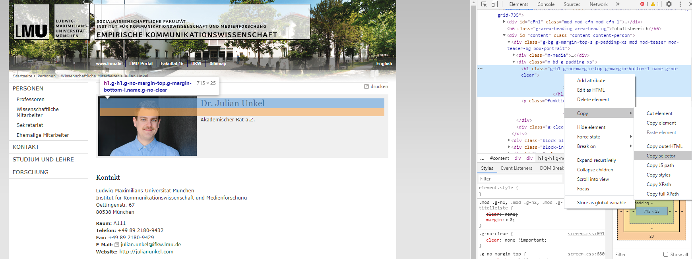
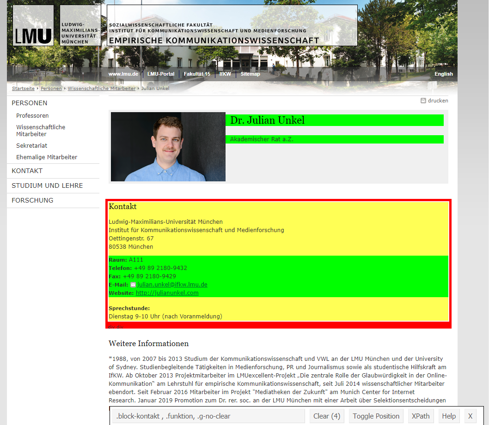

# Web Scraping

Web Scraping bezeichnet allgemein Verfahren zur automatisierten Extraktion von Inhalten auf Webseiten. In unserem Fall setzen wir hierzu ein Skript in R auf, das die uns interessierenden Elemente auf Webseiten identifziert und in einem R-Objekt speichert. Hierfür benötigen wir das zum Tidyverse gehörige Package `rvest`, das wir auch einzeln über `install.packages("rvest")` installieren können:

```{r, eval=FALSE}
install.packages("rvest")
```

`rvest` zählt jedoch nicht zu den Kernpackages des Tidyverse und muss daher separat geladen werden:

```{r, message=FALSE, warning=FALSE}
library(tidyverse)
library(rvest)
```

Mittels `rvest` laden wir zunächst den HTML-Quelltext einer Webseite herunter und wählen anschließend die HTML-Elemente aus, die uns interessieren. Wir benötigen also zunächst eine Möglichkeit, schnell für uns interessante HTML-Elemente auf einer Webseite identifizieren zu können.

## HTML-Elemente identifizieren

Keine Angst: wir müssen nicht den gesamten Quellcode einer Webseite durchlesen, um entsprechende HTML-Elemente zu finden. Moderne Browser bieten in der Regel eine _Untersuchen_-Funktion, mit der HTML-Elemente per Klick im Code der Webseite hervorgehoben werden. In _Google Chrome_ klicken wir hierzu per Rechtsklick auf das Element, das wir identifizieren möchten, und gehen dann auf _Untersuchen_. Möchten wir z. B. auf [meiner Insitutswebseite](https://www.ls1.ifkw.uni-muenchen.de/personen/wiss_ma/unkel_julian/index.html) meinen Namen _scrapen_, zeigt sich folgendes Bild:^[Wir üben mit meinem Profil, nicht weil ich eine ausgeprägte narzisstische Ader habe, sondern weil ich hier relativ sicher sein kann, dass ich die Zustimmung habe, auch auf diese Daten zugreifen zu dürfen.]



Im rechten Bildschirmbereich (oder je nach Einstellung auch links, oben oder unten) öffnet sich der Quellcode, wobei das gewählte Element grau hervorgehoben ist (`<h1 class="g-h1` usw.). Mit einem Rechtsklick im Codebereich auf ein Element öffnet sich ein weiteres Menü, über das wir via _Copy - Copy selector_ den zugehörigen _CSS Selector_ (also die genaue Kombination aus Tags, Klassen und IDs, die dieses Element identifiziert) kopieren, was in diesem Fall `#content > div.g-bg.g-margin-top-s.g-padding-xs.mod.mod-teaser.mod-teaser-bg.box-portrait > div.m-bd.g-padding-xs > h1` entspricht.^[*Copy selector* erzeugt oft eine sehr lange Kette, die in der Regel jedoch gar nicht nötig ist, um das jeweilige Element eindeutig zu identifizieren. Tatsächlich wären wir hier z. B. auch nur mit der Klasse `.g-h1` schon erfolgreich.]

Noch komfortabler gelingt die Identifikation mit dem Tool [Selector Gadget](https://rvest.tidyverse.org/articles/selectorgadget.html), das vom `rvest`-Team zur Verfügung gestellt wird. Hierbei handelt es sich um ein [Bookmarklet](https://de.wikipedia.org/wiki/Bookmarklet), das per Klicks die Identifikation von einem oder auch mehreren HTML-Elementen ermöglicht.

Hierzu muss das Tool erst einmal durch Ziehen des Links auf die Lesezeichenleiste des Browsers installiert werden. Im Anschluss kann das Tool durch Klicken auf das Lesezeichen auf jeder Webseite gestartet werden. Ein Klick auf ein Element und das Tool versucht, es zu identifzieren; der zugehörige Selector wird in der Leiste unten angezeigt:



- grün hervorgehoben sind Elemente, die bewusst per Klick ausgewählt wurden
- gelb hervorgehoben sind Elemente, die mit dem aktuellen Selector ebenfalls ausgewählt werden. Per Klick auf diese werden diese deselektiert und das Tool versucht einen Selector zu finden, das diese Elemente nicht mit umfasst. 
- rot hervorgehoben sind Elemente, die gezielt deselektiert wurden

Im Anschluss kann der zugehörige Selector einfach aus der Leiste unten kopiert werden.

## Web Scraping mit `rvest`

Nachdem wir die uns interessierenden HTML-Elemente identifziert haben, können wir uns ans eigentliche Web Scraping machen. 

### Quellcode einlesen mit `read_html()`

Als erstes laden wir hierzu den Quellcode der betreffenden Webseite herunter. Hierzu stellt uns `rvest` (bzw. ein Package, auf dem `rvest` aufbaut) die Funktion `read_html()` zur Verfügung, der wir einfach die jeweilige URL als String übergeben können:

```{r scrape_ifkw}
ifkw <- read_html("https://www.ls1.ifkw.uni-muenchen.de/personen/wiss_ma/unkel_julian/index.html")
```

Alle folgenden Funktionen können in einer Pipe verwendet werden.

### Elemente auswählen mit `html_nodes()`

Zur Auswahl von HTML-Elementen nutzen wir die Funktion `html_nodes()`, der wir einen CSS-Selector als Argument übergeben. Wir haben z. B. oben gesehen, dass der Name auf den IfKW-Profilseiten in einem Element mit der Klasse `g-h1` steht:

```{r}
ifkw %>% 
  html_nodes(".g-h1")
```

Dies hat nun das gesamte Element ausgewählt. Bei sehr verschachtelten HTML-Dokumenten können wir die Funktion auch mehrfach hintereinander aufrufen, um uns nach und nach zu dem uns interessierenden Element "vorzutasten". Hier wählen wir zunächst den Inhaltsbereich der Seite aus (ID: `content`) und wählen innerhalb dieses Bereichs alle Elemente mit dem HTML-Tag `<span>` aus:

```{r}
ifkw %>% 
  html_nodes("#content") %>% 
  html_nodes("span")
```

Zum Vergleich: Beschränken wir die Auswahl zuvor nicht mittels der ID `content`, erhalten wir auch alle `<span>`-Elemente, die im Menübereich etc. stehen.

```{r}
ifkw %>% 
  html_nodes("span")
```

Wir können zudem mehrere Elemente gleichzeitig auswählen, indem wir die zugehörigen Selektoren durch Kommas `,` trennen. So stehen in den IfKW-Profilen die Kontaktinformationen beispielsweise in HTML-Elementen, die die Klassen `raum`, `telefon`, `fax`, `email` und `website` haben:

```{r}
ifkw %>% 
  html_nodes(".raum, .telefon, .fax, .email, .website")
```

### Text aus HTML-Elementen extrahieren mit `html_text()`

Meistens interessiert uns nicht das gesamte HTML-Element samt Tags und Attributen, sondern lediglich der Text, der in diesem Element steht. Diesen extrahieren wir mit `html_text()`:

```{r}
ifkw %>% 
  html_nodes(".g-h1") %>% 
  html_text()
```

Das ist schon näher am gewünschten Ergebnis, den Namen zu extrahieren -- der String enthält zwar noch viel unnötigen Whitespace (`\n` steht für *N*ewline, also einen Zeilenumbruch), aber dagegen haben wir ja auch schon eine Lösung gelernt (siehe Kapitel \@ref(squish)):

```{r}
ifkw %>% 
  html_nodes(".g-h1") %>% 
  html_text() %>% 
  str_squish()
```

Das ganze klappt natürlich auch mit mehreren Elementen gleichzeitig. So extrahieren wir den Text aller Kontaktinformationen:

```{r}
ifkw %>% 
  html_nodes(".raum, .telefon, .fax, .email, .website") %>% 
  html_text()
```

### Attribute aus HTML-Elementen extrahieren mit `html_attr()`

Neben dem Text sind zudem Attribute der selektierten HTML-Elemente für uns von Interesse. Diese können wir mit der Funktion `html_attr()`, wobei wir das uns interessierende Attribut als String übergeben müssen.

Einer der häufigsten Anwendungsfälle ist hierbei die Extraktion von Links aus Webseiten. Aus dem vorhergehenden Kapitel (siehe Kapitel \@ref(htmltags)) wissen wir, dass Links in HTML in einem `<a>`-Tag stehen und das Ziel des Links über das Attribut `href` definiert wird. So extrahieren wir beispielsweise alle Link-Ziele, die im Inhalt meines IfKW-Profils stehen:

```{r}
ifkw %>% 
  html_nodes("#content") %>% # Inhaltsbereich auswählen
  html_nodes("a") %>%        # Alle Links (<a>-Tag) auswählen
  html_attr("href")          # Attribut "href" extrahieren
```

Ein weiterer häufiger Anwendungsfall ist das Extrahieren von Bilddaten. Diese werden in HTML durch ein ``-Tag eingebunden, wobei die zugehörige Bilddatei über das Attribut `src` angeben wird. So extrahieren wir beispielsweise den (relativen) Dateipfad aller Bilder auf dieser Seite:

```{r}
ifkw %>% 
  html_nodes("img") %>% 
  html_attr("src")
```

Gleichzeitig zeigt dies auch schon eine Schwierigkeit beim Web Scraping auf: oft führen Webseiten-Betreiber*innen Schritte durch, die das Web Scraping erschweren. Wenn Sie beispielsweise den ersten Bildpfad (`cms-static.uni-muenchen.de/default/lmu/img/blank.png`) in einen Browser kopieren, werden Sie sehen, dass sich dahinter mitnichten das schöne Institutsbild aus dem Seitenkopf befindet, sondern ein Blanko-Bild, das dann anderweitig durch das Bild im Seitenkopf ersetzt wird. 

## Effizientes Scraping

Mit diesen vier Funktionen -- `read_html()`, `html_nodes()`, `html_text()` und `html_attr()`^[Eine fünfte Funktion, `html_table()` soll nicht unerwähnt bleiben. Hierbei handelt es sich um eine _Convenience_-Funktion, die eine gesamte Tabelle extrahiert und automatisch in einen Dataframe umwandelt.] -- können wir bereits so gut wie alle Web-Scraping-Aufgaben bewältigen. Bisher führen wir unseren Code jedoch nur auf einer einzigen Webseite auf, deren Informationsgehalt wir vermutlich genauso schnell oder schneller von Hand hätten erfassen können. Wirklich effizient scrapen wir daher erst, wenn wir die bisher gelernten Inhalte kombinieren und uns Muster in Webseiten zu Nutze machen, um dieselben Scraping-Schritte auf mehrere Seiten anwenden zu können.

Rufen wir uns nochmals die Schritte in Erinnerung, um die Namens- und Kontaktinformationen von meinen IfKW-Profil zu scrapen:

```{r}
# Quellcode einlesen
ifkw <- read_html("https://www.ls1.ifkw.uni-muenchen.de/personen/wiss_ma/unkel_julian/index.html")

# HTML-Elemente extrahieren
kontakt <- ifkw %>% 
  html_nodes(".g-h1, .raum, .telefon, .fax, .email, .website") %>% 
  html_text() %>% 
  str_squish()

kontakt
```

Wir speichern diese Informationen zur besseren Weiterverarbeitung in einem Tibble:

```{r}
kontakt_tibble <- tibble(
  name = kontakt[1],
  raum = kontakt[2],
  telefon = kontakt[3],
  fax = kontakt[4],
  email = kontakt[5],
  website = kontakt[6]
)

kontakt_tibble
```

Was, wenn wir diese Schritte nun auch auf andere IfKW-Profile anwenden möchten? Es ist zu vermuten, dass dieses Schema auch bei anderen Profilen eingehalten wird. Wir können den Code also in eien Funktion umwandeln, die die jeweilige Profilseite als Argument aufnimmt:

```{r}
scrape_ifkw <- function(url) {
  # Quellcode einlesen
  ifkw <- read_html(url)
  
  # HTML-Elemente extrahieren
  kontakt <- ifkw %>% 
    html_nodes(".g-h1, .raum, .telefon, .fax, .email, .website") %>% 
    html_text() %>% 
    str_squish() 
  
  # In Tibble umwandeln
  kontakt_tibble <- tibble(
    name = kontakt[1],
    raum = kontakt[2],
    telefon = kontakt[3],
    fax = kontakt[4],
    email = kontakt[5],
    website = kontakt[6]
  )
  
  # 5 Sekunden warten, um den Server bei vielen Anfragen
  # nicht zu überlasten
  Sys.sleep(5)
  
  # Tibble zurückgeben
  return(kontakt_tibble)
}
```

Nun benötigen wir nur noch einen Vektor mit den Profilseiten, die wir scrapen möchten:

```{r}
to_scrape <- c(
  "https://www.ls1.ifkw.uni-muenchen.de/personen/wiss_ma/unkel_julian/index.html",
  "https://www.ls1.ifkw.uni-muenchen.de/personen/professoren/brosius_hansbernd/index.html"
)
```

Und schon können wir mithilfe der `map_`-Funktionen (siehe Kapitel \@ref(#tidyiteration)) unsere Scrape-Funktion auf alle Profilseiten anwenden. Da unsere Funktion ein Tibble ausgibt, können wir `map_dfr()` verwenden, um die resultierenden Tibbles zeilenweise miteinander zu verbinden:

```{r}
ifkw_kontakte <- map_dfr(to_scrape, scrape_ifkw)
```

Das Resultat:

```{r}
ifkw_kontakte
```

## Verantwortungsbewusstes Scrapen

Zum Abschluss noch einige "Verhaltensregeln" beim Web Scraping:

- Seitenspezifische Regeln beachten: viele Webseiten legen in einer Datei namens `robots.txt` fest, wie nicht-menschliche "Besucher*innen" die Seite aufrufen dürfen; zudem gibt es oft "Terms of Service" oder ähnliches. Wenn eine Webseite Scraping untersagt, sollte das auch beherzigt werden.
- Sparsam scrapen: Das heißt zum einen, nur das abzurufen, was wirklich benötigt wird. Zum anderen sollten Server auch nicht mit Anfragen überlastet werden; oft ist es schon ausreichend, eine kleine Wartezeit von ein paar Sekunden in entsprechende Scraping-Funktionen einzubauen.
- Vorstellig werden: HTTP-Anfragen enthalten im Header einen sogenannten _User-Agent_, eine Textzeile, die dem Server mitteilt, _wer_ gerade eine Anfrage stellt. Bei der Nutzung von Webbrowsern wird hier z. B. der Name und die Versionsnummer des verwendeten Browsers mitgeteilt. Diese Textzeile kann jedoch beliebig angepasst werden, um den Servern weitere Informationen bereitzustellen.

Ein R-Package, das beim verantwortungsbewussten Scrapen viel Hilfestellung leistet, ist `polite`, das [hier](https://dmi3kno.github.io/polite/) näher beschrieben wird.

Mit der enthaltenen Funktion `bow()` stellen wir uns dem Server zunächst (optional mit eigenem _User-Agent_) vor; dabei werden auch die seitenspezifischen Regeln in der `robots.txt` abgerufen:

```{r}
library(polite)
session <- bow("https://www.ls1.ifkw.uni-muenchen.de/personen/wiss_ma/unkel_julian/index.html",
               user_agent = "R-Kurs Computational Methods in der politischen Kommunikationsforschung")
session
```

Wir sehen, dass wir hier prinzipiell scrapen dürfen, zwischen einzelnen _Crawls_ jedoch 5 Sekunden warten sollten. Die Funktion `scrape()` ersetzt nun `read_html()` aus `rvest` und berücksichtigt automatisch die zugehörigen Regeln.^[Das heißt auch, dass `scrape()` die Arbeit verweigert, wenn Scrapen nicht erlaubt ist.] Anschließend können die gewohnten HTML-Extraktionsfunktionen aus `rvest` genutzt werden:

```{r}
ifkw <- scrape(session)

ifkw %>% 
  html_nodes(".g-h1") %>% 
  html_text() %>% 
  str_squish()
```

## Übungsaufgaben

Erstellen Sie für die folgenden Übungsaufgaben eine eigene Skriptdatei oder eine R-Markdown-Datei und speichern diese als `ue15_nachname.R` bzw. `ue15_nachname.Rmd` ab.

---

```{exercise, label="ue15a1"}
Web Scraping I:
```

Scrapen Sie von [diesem Artikel](https://www.sueddeutsche.de/sport/hsv-kiel-hecking-ausgleich-1.4931360) folgende Informationen:

- Erscheinungsdatum und Uhrzeit ('9. Juni 2020, 9:20 Uhr')
- Kicker ('HSV in der zweiten Liga')
- Überschrift ('Das sind Dinge, die sehr, sehr weh tun"')
- Lead-Absatz ('So wird es eng mit dem Aufstieg...')

---

```{exercise, label="ue15a2"}
Web Scraping II:
```

Im Artikeltext verbirgt sich ein Link zu einer Themenseite von _suedeutsche.de_. Extrahieren Sie den Ziellink.

---

```{exercise, label="ue15a3"}
Web Scraping III:
```

Erstellen Sie eine Funktion, um die Informationen aus Aufgabe 1 von einem beliebigen _sueddeutsche.de_-Artikel zu extrahieren. Testen Sie Ihre Funktion zusätzlich zum obigen Artikel auch anhand von [diesem Artikel](https://www.sueddeutsche.de/sport/stuttgart-hsv-2-bundesliga-castro-1.4921867).
